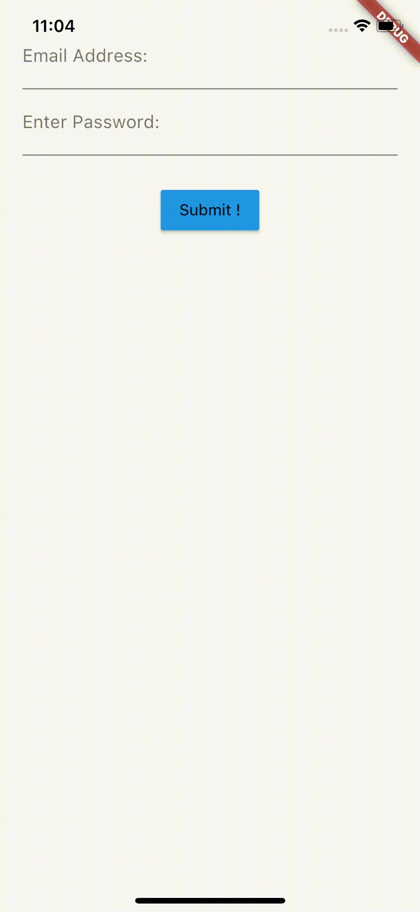

# [flutter] login using stateful example

A new Flutter project, login using statefull.

## Getting Started

For help getting started with Flutter, view our online
[documentation](https://flutter.io/).
